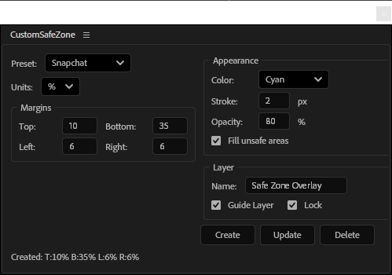

# AE-CustomSafeZone

 
 ScriptUI panel for After Effects that creates customizable safe zone overlays with built-in presets for social media platforms

## Installation

1. Download `CustomSafeZone.jsx`
2. Insall using File > Scripts > Install ScriptUI Panel...
3. Restart After Effects
4. Access via `Window > Custom Safe Zone`